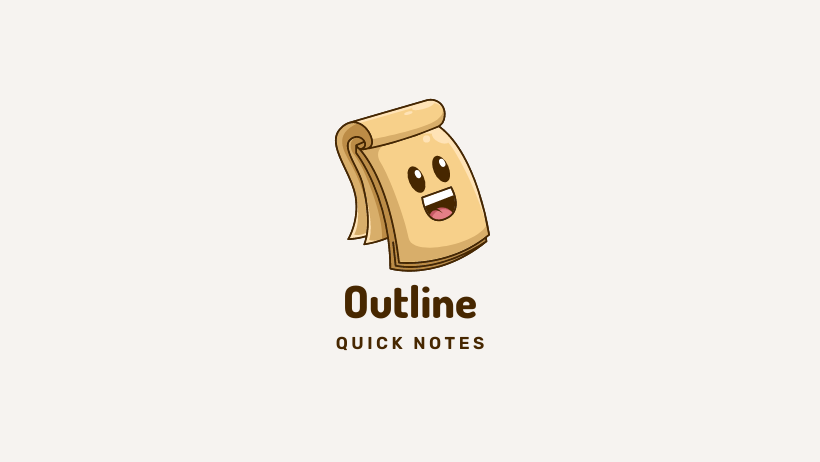

<h1 align="center">Outline: Quick notes</h1>

<!-- ABOUT THE PROJECT -->

## About The Project

Outline lets you make notes on the fly while accessing the internet.

It helps you organise your notes. It lets you add rich formatted text, images and links or any thing you find interesting while you browse the internet.

There are already lot of other extension/software that let you do this. However, I didn't find one that really suited my needs so I created this extension as my personal use. But later I realise this can be helpful for other people so here it is.

### Motivation of this project

I don't want to get context switch while I am reading on internet. I dont want to pile up this information as most of the time it is not required. If something is important I can always save my pointers to my notes. I simply want something that jot down whatever point I like somewhere and I can review later. This also help in my notes to be less clutter. As you can make sure it is worth to save it in notes or not. So I didn't find something like this on internet.
_Apple_ recently launched something similar quick notes but it only worked on safari and you need mac for that :-(

### Built with

- [React.js](https://reactjs.org/)
- [Vite.js](https://vitejs.dev)
- [Qull.js](https://quilljs.com)

(<a href="#top">back to top</a>)

<!-- GETTING STARTED -->

### Getting Started

You can simply install this from chrome store. It should work any chrome related browser(brave,opera) etc.

### General Architecture

This application does not use any external service. This application is privacy focused. So whatever number of notes you have its only between **you and your browser**. _Keep taking backup time to time other wise there is no way to restore your data_.

**Note:** In future will add to export and import your data

#### Store

Store is where your all data stored. For this I use `chrome storage` [api](https://developer.chrome.com/docs/extensions/reference/storage/).
So inside api it just one store which saved these keys:

- `urlName`:
  - `pathname`
    - `content` -> Original data that you saved
    - `title` -> Title of the web page
    - some other flags for feature related

So there can be n number of pages inside urlname. So it will be distinguished by pathname. These are web jargons if you are not interested in tech part you can skip it otherwise you can always read this on internet.

<!-- CAVEATS -->

### Caveats

Since this extension rely on chrome `storage` [api](https://developer.chrome.com/docs/extensions/reference/storage/). So it has limited memory. More you can look into chrome api. So if specific notes are not required, remove time to time to have more sync memory. Currently its using `local` api with `unlimitedStorage` permission. _So your data will not be synced, keep this in mind_

<!-- ROADMAP -->

## Roadmap

- [x] Add License file
- [x] Add back to top links
- [ ] Add product demo gif/video
- [ ] Add detailed architecture map which can be understand easily
- [ ] Add issue template
- [ ] Convert project to typescript
- [ ] Enable sync to third party service or simple json download
- [ ] Firefox support
- [ ] Current code is part of POC and I didn't get time to refactor. So there are lot of improvement in code readability and build process

<!-- CONTRIBUTING -->

## Contributing

Contributions are what make the open source community such an amazing place to learn, inspire, and create. Any contributions you make are **greatly appreciated**.

If you have a suggestion that would make this better, please fork the repo and create a pull request. You can also simply open an issue with the tag "enhancement".
Don't forget to give the project a star! Thanks again!

1. Fork the Project
2. You have to run two different command for development. `yarn run dev-build` . This will start your server in watch mode.
3. After that you have to refresh chrome extension after any change you have done.
4. _Optional:_ If you never worked on chrome extension development before. Read this [guide](https://developer.chrome.com/docs/extensions/mv3/getstarted/)
5. Create your Feature Branch (`git checkout -b feature/AmazingFeature`)
6. Commit your Changes (`git commit -m 'Add some AmazingFeature'`)
7. Push to the Branch (`git push origin feature/AmazingFeature`)
8. Open a Pull Request

(<a href="#top">back to top</a>)

<!-- ACKNOWLEDGMENTS -->

## Acknowledgments

Use this space to list resources you find helpful and would like to give credit to. I've included a few of my favorites to kick things off!

- [Readme Template](https://github.com/othneildrew/Best-README-Template)
- [Chrome api reference](https://developer.chrome.com/docs/extensions/reference/)

(<a href="#top">back to top</a>)

